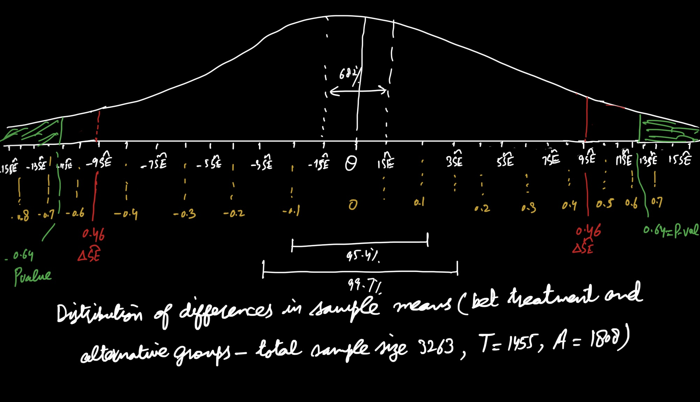

Millions of low-income Americans live in high-poverty neighborhoods, which also tend to be racially segregated and sometimes have issues with community violence. While social scientists have long believed a lack of investment in these neighborhoods contributes to negative outcomes for the residents living in them, it is often difficult to establish a causal link between neighborhood conditions and individual outcomes. The Moving to Opportunity (MTO) demonstration was designed to test whether offering housing vouchers (that cover some or all of rental costs) to families living in public housing in high-poverty neighborhoods could lead to better experiences and outcomes by providing financial assistance to move to higher income neighborhoods. 

Between 1994 and 1998 the U.S. Department of Housing and Urban Development enrolled 4,604 low-income households from public housing projects (governement owned housing, usually large apartment blocks) in Baltimore, Boston, Chicago, Los Angeles, and New York in MTO, *randomly assigning* enrolled families in each site to one of three groups: (1) The low-poverty voucher group received special MTO vouchers, which could only be used to cover rent for apartments/homes in census tracts with 1990 poverty rates below 10% and counseling to assist with relocation; (2) the traditional voucher group received regular section 8 vouchers, which they could use to cover rent for apartments/houses anywhere; and (3) the control group, who received no vouchers but continued to qualify for any project-based (government-owned) housing assistance they were entitled to receive. Today we will use the MTO data to learn if being given the opportunity to move to lower-poverty neighborhoods improved participants' economic wellbeing. This exercise is based on the following article and the data is a subset of the data used for this article:

Ludwig, J., Duncan, G.J., Gennetian, L.A., Katz, L.F., Kessler, J.R.K., and Sanbonmatsu, L., 2012. "[Neighborhood Effects on the Long-Term Well-Being of Low-Income Adults](https://dx.doi.org/10.1126/science.1224648)." *Science*, Vol. 337, Issue 6101, pp. 1505-1510.

NEW TO THIS HW: Consider a policy setting where if the conclusion of this research study is that the Low Poverty Voucher program improves economic well being relative to the control and Section 8 programs (combined) then policy makers will eliminate the Section 8 program and replace it with an expanded Low Poverty Voucher Program. If the conclusion of this research study is that the Low Poverty Voucher Program seems to have a similar effect on economic well being as the Control and Section 8 programs (combined) then they will continue the Low Poverty Voucher Program at its current size and continue to collect more data for a larger study over a longer time period. 

The file `mto2_HW9.csv` includes the variables listed below for adult participants in the voucher, control, and Section 8 groups. For this analysis we will consider the Low Poverty Voucher program to be the treatment and the Control and Section 8 groups combined to be the Alternative. 

 Name                             |Description
 -------------------------------- |----------------------------------------------------
 `group`                          | factor with 3 levels: `lpv` (low-poverty voucher), `sec8` (traditional section 8 voucher), and `control` 

 `econ_ss_zcore`                  | Standardized measure of economic self-sufficiency, centered around the control group mean and re-scaled such that the control group mean = 0 and its standard deviation = 1. Measure aggregates several measures of economic self-sufficiency or dependency (earnings, government transfers, employment, etc.)

 `crime_vic`                      | Binary variable, `1` if a member of that household was the victim of a crime  in the six months prior to being assigned to the MTO program, `0` otherwise based on self-report


The data we will use are not the original data as this dataset has been modified to protect participants' confidentiality, but the results of our analysis will be consistent with published data on the MTO demonstration. 

```{r}
mto2 <- read.csv("data/mto2_HW9.csv")
library(tidyverse)
```

## Question 1 [20 pts]

### 1a [3 points]

Create a dichotomous variable, *treat* that takes the value 1 if a household is in the Low Poverty Voucher group and takes the value 0 if a household is in either the Control group or the Section 8 Group.  How many households in the data are in the treatment group? How many households in the data are in this combined alternative group?

### 1b [4 points]

What is the specific causal question the researchers wanted to answer? What is the missing counterfactual for one household in the Low Poverty Voucher treatment group? 

### 1c [4 points]

State the Null and Alternative Hypotheses that the researchers want to test (use a two-sided alternative). 

### 1d [3 points]

What is a Type 1 error for this Hypothesis test and what would the real-world consequences of a Type 1 error be given the actions policy makers would make as described above?

### 1e [3 points]

What is a Type 2 error for this Hypothesis test and what would the real-world consequences of a Type 2 error be given the actions policy makers would make as described above?

### 1f [3 points]

What alpha level would you recommend using for this hypothesis test and why?


## Answer 1

### Answer 1a

```{r}
mto2.new <- mto2 %>%
  mutate(treat = if_else(group == 'lpv', 1, 0))
num.1 = nrow(subset(mto2.new, treat == 1))
num.0 = nrow(subset(mto2.new, treat == 0))
num.1
num.0
```
In the Low Voucher Poverty group (treatment group) there are 1455 households while there are 1808 households in the combined alternative group (containing control and section 8 groups - combined alternate group).  
### Answer 1b
*SCQ:* What is the impact of providing Low Poverty Voucher (LPV) (intervention or treatment group) relative to combined alternative group containing families who were either provided regular section 8 vouchers or no-voucher but continued qualification for any project-based housing assistance (in short, control group) on the economic well-being of the families living in public housing in high-poverty neighborhoods in America. *MCF for one household in the Low Poverty Voucher treatment group:* What the economic-well being of the household living in the public housing in high poverty neighborhood in America which was given Low Poverty Voucher (LPV) would have been if that household was instead either provided regular section 8 vouchers or no-voucher but all else remained the same.   

### Answer 1c
The Null Hypothesis is: $\mu_T - \mu_A = 0$ (where $T$ indicates treatment and $A$ indicates comparison).
The Alternative Hypothesis is:$\mu_T - \mu_A \neq 0)$
Explicatively, Null hypothesis states that the average treatment effect is zero i.e On average, Low Poverty Voucher (LPV) (treatment variable) does not improve economic well-being relative to the combined alternate group. Alternate hypothesis states that on average, there is an impact of LPV relative to combined alternative group on the economic well-being of the households (can be positive or negative - two sided alternative)

### Answer 1d
A Type I error is the probability of falsely rejecting the null hypothesis when it is true; in this case, it is the probability of concluding that the LPV intervention changed the average economic well-being of the household when it did not. The real world consequence of this could be that policy makers will eliminate the section 8 program and replace it with the expanded LPV program when this LPV program is not effective at changing the economic outcome.

### Answer 1e
A Type II error is the probability of failing to reject the null hypothesis when the null hypothesis is false; in this case it is the probability of concluding that we cannot reject that the the LPV intervention has no impact on the average economic well-being of the household when it did. The real world consequence of this could be that the policy makers will continue the LPV Program at its current size and continue to collect more data for a larger study over a longer time period. 

### Answer 1f
We normally set the alpha level at $\alpha = 0.05$. If I were making this decision I would need to assess the harm of each consequence above. A possible answer and justification is: I recommend an alpha level of .01 because the real world consequence of Type I error, elimination of the section 8 program and replacement with the expanded LPV program when this LPV program is not effective at changing the economic well being of household is much adverse than Type II error, the situation of continuing with the current LPV program and collecting more data for a larger study over a longer period. In case if LPV program is falsely believed to be the only effective one and is expanded, more funds will be injected through this actually ineffective plan, thus it will just be a huge wastage.  Also when all other options will be eliminated, chances of improvement will dwindle and it will seriously affect the families getting benefit from regular section 8 program. Thus, type 1 error will result in limiting options just to one - that too will be ineffective, wastage of funds, and no improvement in future, while in case of type II error, comparatively, there is nothing to lose and the consequence of conducting more research and data collection are likely to render better understanding of the issue at bigger level which still provides hope of finding right solution.  

\newpage
## Question 2 [15 pts]

### 2a [5 points]

Make a histogram of the *econ_ss_zcore* outcome variable for households in the treatment group. Calculate summary statistics of this outcome variable for the treatment group. Describe the distribution of economic self-sufficiency in the sample for this set of households. 

### 2b [5 points]

Consider the sampling distribution of the sample mean economic self-sufficiency variable over repeated realizations of the data from the data generating mechanism that created this data set. What are the shape, mean, and estimated standard error of this sampling distribution? How do you know?

### 2c [3 points]

Calculate a 90% confidence interval for the mean economic self-sufficiency for those with a Low Poverty Voucher in the data generating mechanism. 

### 2d [2 points]

Give a statistical interpretation of this confidence interval. 

## Answer 2

### Answer 2a

```{r}
mto2.new.t <- mto2.new%>%
  filter(treat == 1)
hist(mto2.new.t$econ_ss_zscore)
summary(mto2.new.t$econ_ss_zscore)
sampt.mean <- mean(mto2.new.t$econ_ss_zscore)
sampt.sd <- sd(mto2.new.t$econ_ss_zscore)
sampt.mean
sampt.sd
```
The distribution of economic well-being seems quite symmetric because of of conversion to z-scale. It is unimodal and is converged more around 0 i.e majority of the households are falling between -1 and 1. The summary statistics are means of observed data for the treatment group with a sample size of 1455. The distribution is not strongly skewed, do not have extreme outliers, and do not show bimodality. There are no spikes,and gaps. The distribution ranges between -9.09 to 8.39. The mean is -0.227 and the median is 0.006 which are relatively close and show that the distribution is symmetric. Standard deviation is 1.17.  

### Answer 2b

```{r}
se.t.hat <- sampt.sd/(sqrt(num.1))
se.t.hat
```
ANSWER 2b: As here the parameter of interest is the average economic well-being in population and we have a large sample - 3263 households, therefore assumptions for the application of Central Limit Theorem holds here. Thus, the shape of the sampling distribution of the z-scores of mean economic self-sufficiency variable over repeated realizations of the data from the data generating mechanism is a t-distribution with $1454$ degrees of freedom (where 1454 is the number of households receiving LPV (treatment group) minus 1). The mean of this sampling distribution of the z-scores is 0 and the estimated error of this sampling distribution is equal to 0.031, 3.1 percentage points.
### Answer 2c

```{r}
num.1
ci.90.t <-  c(sampt.mean - qt(0.95,df = num.1 - 1)*se.t.hat, 
  sampt.mean + qt(0.95,num.1 - 1)*se.t.hat)
ci.90.t

```

### Answer 2d
The 90% confidence interval for the mean economic self-sufficiency for those with Low Poverty Voucher in the data generating mechanism is (-7.3%, 2.8%). Over repeated realizations of data from this data generating mechanism, 90% of intervals constructed in this manner will contain the true mean economic self-sufficiency for those using Low Poverty Voucher and 10% will not.
\newpage
## Question 3 [12 pts]

### 3a [4 points]

In this question you will carry out a hypothesis test of whether or not the mean of the *econ_ss_zcore* outcome variable for treated households equals zero in the data generating mechanism. Use an alpha level of 0.10. 

State the parameter of interest. State the estimator you will use for this parameter from the observed data (the observed data summary statistic). State the Null and Alternative Hypotheses (where you use a symbol for the parameter please define it). 

### 3b [3 points]

Describe the sampling distribution of the sample summary statistic *under the Null Hypothesis* (give the shape, mean, and estimated standard error). 

### 3c [1 points]

Calculate the number of standard errors the observed summary statistic is from the Null value of the parameter of interest. 

### 3d [3 points]

Calculate the p-value for the hypothesis test. Interpret this p-value.

### 3e [1 point]

Give the conclusion of the hypothesis test. 

## Answer 3

### Answer 3a
The parameter of interest here is the true mean of the *econ_ss_zscore* outcome variable for the treated household. Here, I will use the summary statistic for the treatment group (sample mean for treatment group) for the *econ_ss_zscore* of the sample of size 1455 as an estimator. 

Let $\mu_T$ be the true mean of the *econ_ss_zscore* outcome variable for treated household in the data generating mechanism.  
The Null and Alternative Hypotheses are:
The Null Hypothesis is: $\mu_T = 0$ (where $T$ indicates treatment group).
The Alternative Hypothesis is:$\mu_T \neq 0)$


### Answer 3b

```{r}

se.t.hat <- sampt.sd/(sqrt(num.1))
se.t.hat

```
Under the null hypothesis, the sampling distribution for the the sample mean economic self-sufficiency variable over repeated realizations of the data from the data generating mechanism is a t-distribution with $1454$ degrees of freedom (where 1454 is the number of households receiving LPV minus 1), having mean 0 and the estimated standard error of this sampling distribution is equal to 0.031, 3.1 percentage points.


### Answer 3c

```{r}
input <- (sampt.mean - 0)/se.t.hat
input
```
The observed mean of the economic self-sufficiency variable is 0.744 estimated standard errors below the Null value 0. 

### Answer 3d
$\alpha = 0.10$
```{r}
2*(pt(input, num.1 - 1))
```
The p-value for this hypothesis test is  0.457 or 46%. The p-value is the probability that if the Null Hypothesis were true, that we would observe data with a mean this far from the Null Value (or any farther), just by chance.

### Answer 3e
As the probability is greater than the our alpha level of 10%, so we fail to reject the Null Hypothesis (which states that the mean of the *econ_ss_zscore* outcome variable for the treated household equals zero in that data generating mechanism). 

\newpage
## Question 4 [9 pts]

### 4a [3 points]

Make a figure with side-by-side boxplots of the economic self-sufficiency outcome variable for the treatment (Low Poverty Voucher) group and the alternative group. Describe any differences you see between the two distributions.

### 4b [6 points]

Not assuming the standard deviation of the outcome is the same in the treatment and alternative groups, calculate 95% and 99% confidence intervals for *the difference* in mean self-sufficiency if a household has a Low Poverty Voucher relative to an Alternative in the data generating mechanism. What is the estimated standard error of this sample difference over repeated realizations of the data?


## Answer 4

### Answer 4a

```{r}
mto2.new %>%
 ggplot(aes(y = econ_ss_zscore, x = factor(treat))) + 
  geom_boxplot()
```
Boxplot shows that both treatment (Low Poverty Voucher) group and the alternative groups seem to have their mean around 0, however, the upper quratile in the alternate group is relatively higher than the treatment group which means that there are households falling in the third quartile of the alternate group which have *econ_ss_zscore* relatively more away from mean of 0. Both the groups have outliers on both above and below the third and 1st quartiles of the distribution; however, the alternate group has relatively higher outliers and larger gaps which shows that despite conversion of *econ_ss_zscore* to z score, still, there is huge spread of economic well-being in this group. Also, in the alternate group, there are many outliers below the first quartile i.e. between -10 to 0.    

### Answer 4b

```{r}
num.t <- num.1
num.t
se.t.hat
sampt.mean
num.c <- num.0

mto2.new.c <- mto2.new%>%
  filter(treat == 0)

sampc.mean <- mean(mto2.new.c$econ_ss_zscore)
sampc.sd <- sd(mto2.new.c$econ_ss_zscore)

se.c.hat <- sampc.sd/(sqrt(num.c))
# difference in mean self-sufficiency

se.dif <- sqrt(se.t.hat^2 + se.c.hat^2)
se.dif

sample.diff = sampt.mean - sampc.mean

t95 <- qt(0.975, num.t + num.c - 2)
t95
t99 <- qt(0.995, num.t + num.c - 2)
t99

#95% confidence interval 
diff.ci95 <- c(sample.diff - t95*se.dif, sample.diff + t95*se.dif)
diff.ci95

#99% confidence interval for each group
diff.ci99 <- c(sample.diff - t99*se.dif, sample.diff + t99*se.dif)
diff.ci99


```
The 95% CI for the true difference in mean economic well-being in treatment and alternative groups (in the data generating mechanism) is (-6.8 percentage points, 10.9 percentage points). Over repeated realizations of data from the same data generating mechanism of pairs of samples of the same size as these treatment and alternative groups, 95% of CIs created in this manner by each of these data realizations will contain the true difference in means and 5% will not.

The 99% CI for the true difference in mean economic well-being in treatment and alternative groups (in the data generating mechanism) is (-9.6 percentage points, 13.7 percentage points). Over repeated realizations of data from the same data generating mechanism of pairs of samples of the same size as these treatment and alternative groups, 99% of CIs created in this manner by each of these data realizations will contain the true difference in means and 1% will not.

The estimated standard error for the difference in observed mean of economic well being in treatment (LPV) group and the alternative group over repeated realizations of this data generating mechanism is 4.5 percentage points.

\newpage
## Question 5 [12 pts]

### 5a [5 points]

Sketch the sampling distribution for the differences in sample means ((between the Low Poverty Voucher and Alternative groups) over repeated realizations of the data *under the Null Hypothesis*. What is the shape of this sampling distribution?  Label the mean of this distribution and the points 1, 2 and 3 estimated standard errors away from the mean (using the estimated SE you calculated in Question 4). 

### 5b [4 points]

What is the mean difference we observe in this data? How many standard errors away from the Null value is it? Put this point on your sketch of the sampling distribution and shade the area under the sampling distribution curve that corresponds to the p-value for this two-sided test. 

### 5c [3 points]

Calculate and interpret the p-value for this hypothesis test. Based on the alpha level you recommended in Question 1 what is the conclusion of the hypothesis test?


## Answer 5

### Answer 5a
$$
H_0: \mu_t - \mu_c = 0 \\
H_a: \mu_t - \mu_c \ne 0
$$
```{r}
se.dif <- sqrt(se.t.hat^2 + se.c.hat^2)
se.dif
```

The sampling distribution for the difference in mean economic well-being between treatment (LPV) group and alternative group is a t-distribution with $df = n_t + n_c -2$ and an estimated standard error equal to $\sqrt{SE^2_t + SE^2_c}$ where $SE_t$ and $SE_c$ are the estimated standard errors associated with each mean separately. Under the Null Hypothesis, the mean of this distribution is 0. The estimated standard error of this distribution we calculated above as `r se.dif`.

### Answer 5b

```{r}
se.away = sample.diff/se.dif
se.away
```
The observed difference in mean economic well-being between treatment (LPV) group and alternative group is about 0.46 estimated standard errors above the Null value.
### Answer 5c

```{r}
pvalue = 2*(1-pt(se.away, num.t + num.c - 2))
pvalue
```
The two sided p-value for this hypothesis test is approximately 0.64. It is the probability that just by chance, we would observe data where the difference in means we observe were this far from the null value or any farther if the Null Hypothesis were true. Because this p-value is much larger than any alpha level (0.01) I recommended in question 1, so I fail to reject the Null hypothesis which stated that the difference in sample means (between the LPV and alternative groups) is 0. In light of this analysis, I conclude that as there seems no difference in mean economic well-being between the treatment and alternative groups so better option is to continue with the existing plan and collect more data for further study. 

\newpage

## Question 6 [8 pts]

### 6a [3 points]

Use the *t.test* command to carry out the same hypothesis test you conducted in Question 5 (two-sided alternative hypothesis, equal standard deviations is not assumed). Compare the p-value results using the *t.test* command versus how you calculated the p-value in Question 5. Also compare the confidence interval given in the *t.test* output to the confidence interval with the same coverage level for the difference in means that you calculated in Question 4.

### 6b [3 points]

Use the *t.test* command to carry out the hypothesis test where the alternative is one sided instead of two-sided but otherwise is the same. Compare the results (the magnitude of the p-value and the degrees of freedom for the test) with the *t.test* results where the alternative hypothesis is two sided [the test you just carried out in the prior paragraph]. What is the relatinship between these two p-values?


### 6c [2 points]

Use the *t.test* command to carry out the 2-sided hypothesis test but now assuming the standard deviation is the same in the treatment and alternative groups. Compare the results (the magnitude of the p-value and the degrees of freedom for the test) with the *t.test* results where equal standard deviations is not assumed [the first hypothesis test you carried out for this question]. 


## Answer 6

### Answer 6a

```{r}
t.test(econ_ss_zscore ~ treat, data = mto2.new, alternative = 'two.sided', 
       var.equal = FALSE, conf.level = 0.95)
```
In this question where p-value is calculated through *t.test* command and in question 5 where it was calculated manually, it is approximately same 0.64, here it is rounded. 
In question 4, the 95% CI for the true difference in mean economic well-being in treatment and alternative groups (in the data generating mechanism) was (-6.8 percentage points, 10.9 percentage points) whereas, here, the 95% confidence interval is very similar to what we calculated although signs and order have been reversed.  This small difference in the p-value and confidence interval are due to difference in the degrees of freedom for the t-distribution that the t.test command uses versus the degrees of freedom we used. 

### Answer 6b

```{r}
t.test(econ_ss_zscore ~ treat, data = mto2.new, alternative = 'less', 
       var.equal = FALSE, conf.level = 0.95)

```
If we assume that the alternative hypothesis is one sided and the difference between the means lies below the 0, then the magnitude of p-value we get is 0.3222 which is almost half of the p-value 0.6444, we had got in part (a) above. The degrees of freedom in both two tail and one tail test is same 3260.3. As we know, in case of two tail test, the p value gets divided on both sides and that was why we were getting collective p-value of 0.6444 for the two tail test above while in case of one tail, we are only getting one side of the p-value which is half.
### Answer 6c

```{r}
t.test(econ_ss_zscore ~ treat, data = mto2.new, alternative = 'two.sided', 
       var.equal = TRUE, conf.level = 0.95)
```
While assuming that the standard deviation is the same in the treatment and alternative groups, we get p-value 0.6515 which is higher than the one we had got in part (a) where we did not make this assumption, it means p-value increases with such assumption. Also, the degrees of freedom in this case has slightly increased from 3260.3 in the last one to 3261 in this part which shows that now larger number of independent values can vary here as compared to the last one.  


